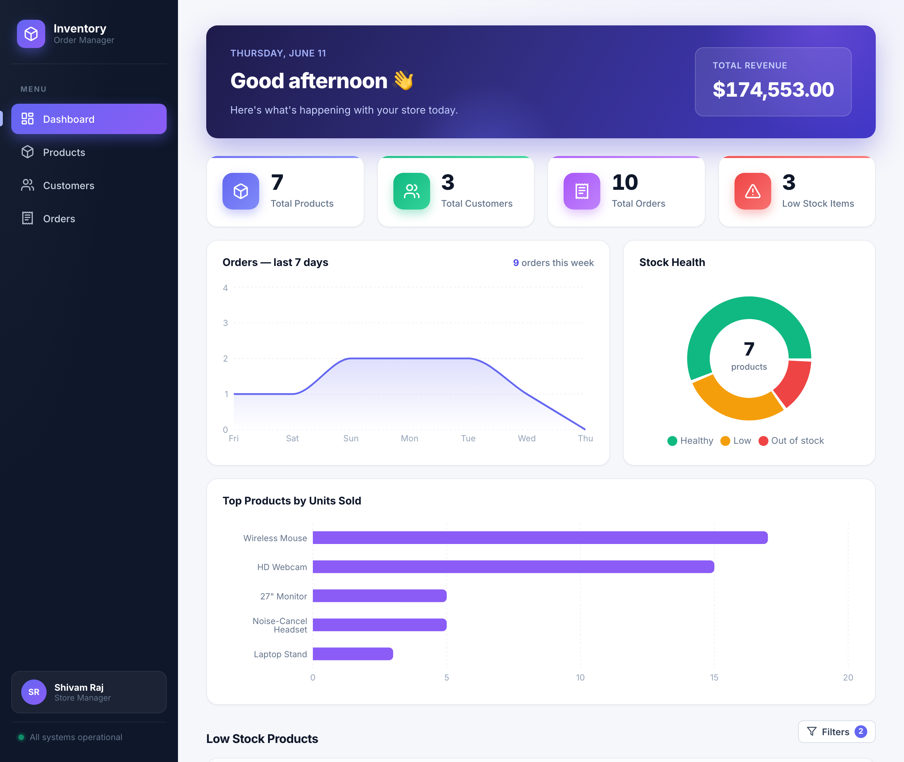
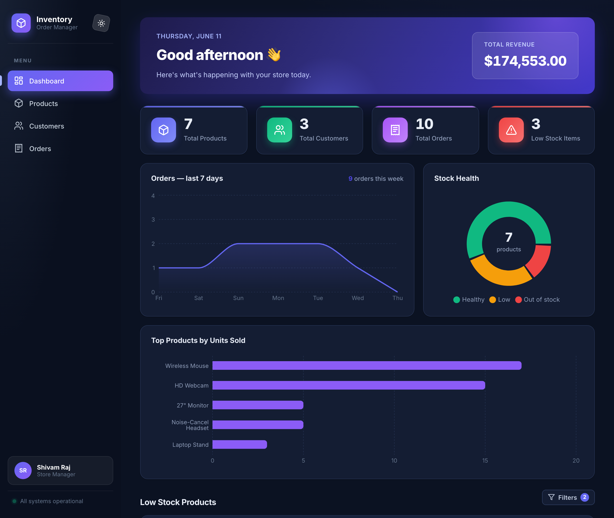
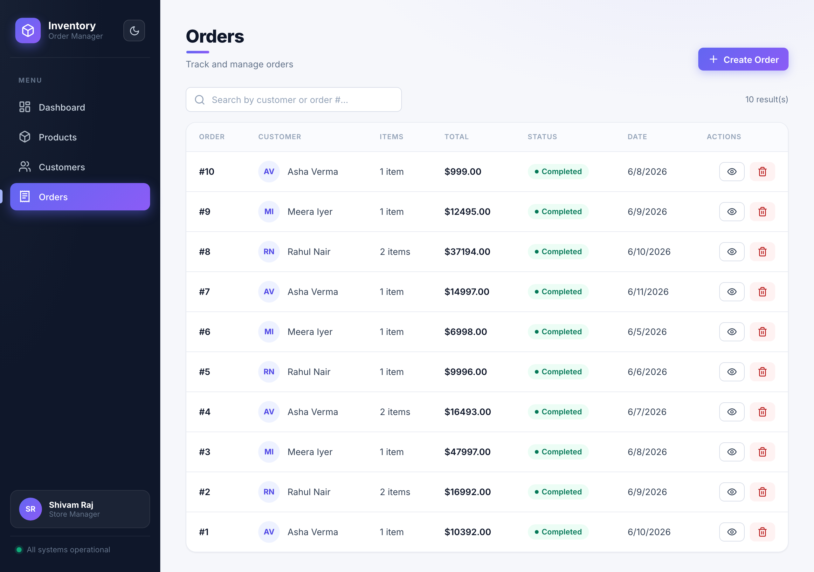
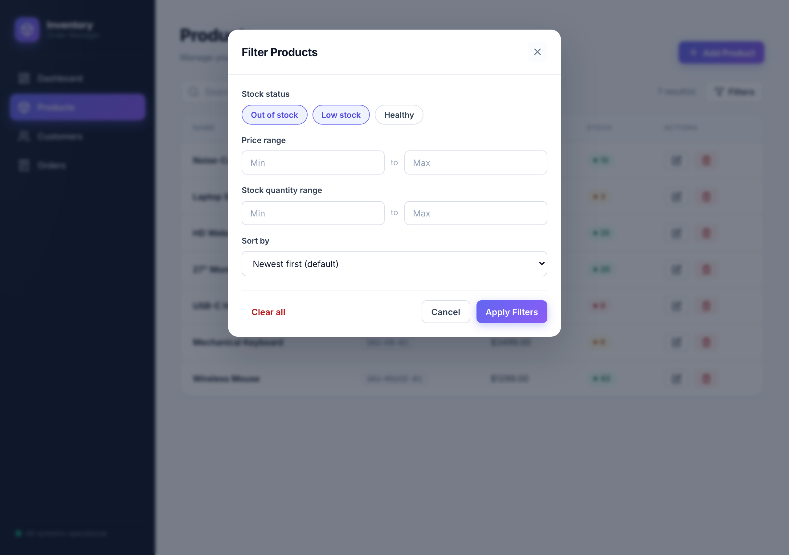

<div align="center">

# 📦 Inventory & Order Management System

**A production-ready, full-stack application for managing products, customers, orders and inventory — with live analytics, dark mode and a fully containerized setup.**


[Features](#-features) · [Quick Start](#-quick-start-docker) · [API Reference](#-api-reference) · [Architecture](#-architecture) · [Business Rules](#-business-rules) · [Deployment](#-deployment)

</div>

---

## 📸 Screenshots

| Light | Dark |
|---|---|
|  |  |

| Orders | Multi-filter modal |
|---|---|
|  |  |

---

## ✨ Features

### Core
- **Product management** — full CRUD with unique-SKU enforcement and stock tracking
- **Customer management** — create / list / delete with unique-email enforcement
- **Order management** — multi-product orders with automatic total calculation, automatic stock deduction, and stock restoration on cancellation
- **Inventory safety** — orders are rejected when stock is insufficient; stock can never go negative (validated in the app **and** by a database constraint)
- **Race-condition safe** — `SELECT … FOR UPDATE` row locking means concurrent orders can never oversell (verified with 20 simultaneous orders against 1 unit of stock)

### Analytics Dashboard
- 📈 **Orders & revenue over the last 7 days** (SQL `GROUP BY` aggregation, gap-filled series)
- 🍩 **Stock health donut** — healthy / low / out-of-stock breakdown with centered total
- 📊 **Top 5 products by units sold** (SQL `JOIN` + `SUM` ranking)
- Live stat cards with count-up animations

### Search & Filtering
- 🔍 **Server-side search** on every list page (Postgres `ILIKE`), debounced on the client (300 ms)
  - Products: by name or SKU · Customers: by name, email or phone · Orders: by customer name or `#id`
- 🎛 **Multi-filter modal** — stock status (multi-select), price range, stock range and sorting, all executed in SQL — available on the Products page **and** the dashboard

### UI / UX
- 🌗 **Dark mode** — token-based theming, persisted, follows OS preference on first visit
- 📱 **Fully responsive** — desktop sidebar collapses to a mobile icon bar
- 💀 Skeleton loaders, toast notifications, empty states, staggered entrance animations
- ♿ Respects `prefers-reduced-motion`
- Zero UI frameworks — hand-written CSS design system with custom properties

---

## 🛠 Tech Stack

| Layer | Technology |
|---|---|
| **Backend** | Python 3.12 · FastAPI · SQLAlchemy 2 · Pydantic v2 |
| **Frontend** | React 18 (Vite) · React Router · Axios · Recharts |
| **Database** | PostgreSQL 16 |
| **Infra** | Docker (multi-stage builds, non-root user) · Docker Compose · nginx |

---

## 🚀 Quick Start (Docker)

> Prerequisite: Docker Desktop (or Docker Engine + Compose v2)

```bash
# 1. Clone and enter the project
git clone <your-repo-url>
cd inventory-order-system

# 2. Create your environment file (edit credentials if you like)
cp .env.example .env

# 3. Build and run everything
docker compose up --build
```

| Service | URL |
|---|---|
| 🖥 Frontend | http://localhost:3000 |
| ⚙️ Backend API | http://localhost:8000 |
| 📚 Swagger docs | http://localhost:8000/docs |

Stop with `docker compose down` — add `-v` to also wipe the database volume.

### Running locally without Docker

<details>
<summary>Backend</summary>

```bash
cd backend
python -m venv .venv && source .venv/bin/activate
pip install -r requirements.txt
cp .env.example .env            # point DATABASE_URL at a running Postgres
uvicorn app.main:app --reload   # http://localhost:8000
```
</details>

<details>
<summary>Frontend</summary>

```bash
cd frontend
npm install
cp .env.example .env            # VITE_API_BASE_URL=http://localhost:8000
npm run dev                     # http://localhost:5173
```
</details>

---

## 🏗 Architecture

```
┌─────────────────┐      REST / JSON      ┌──────────────────┐      SQL       ┌──────────────┐
│  React (Vite)   │ ────────────────────▶ │     FastAPI      │ ─────────────▶ │  PostgreSQL  │
│  nginx (prod)   │ ◀──────────────────── │   SQLAlchemy     │ ◀───────────── │  named vol.  │
└─────────────────┘                       └──────────────────┘                └──────────────┘
   frontend:3000                             backend:8000                         db:5432
```

### Project structure

```
inventory-order-system/
├── docker-compose.yml          # 3 services, named volume, env-driven
├── .env.example                # all configuration (no hardcoded credentials)
├── backend/
│   ├── Dockerfile              # python:3.12-slim, non-root user
│   └── app/
│       ├── main.py             # app wiring, CORS, startup table creation
│       ├── config.py           # pydantic-settings (env-driven config)
│       ├── database.py         # engine, session factory, get_db dependency
│       ├── models/             # SQLAlchemy ORM (one file per aggregate)
│       │   ├── product.py · customer.py · order.py
│       ├── schemas/            # Pydantic request/response contracts
│       │   ├── product.py · customer.py · order.py · dashboard.py
│       └── routers/            # endpoints + business logic
│           ├── products.py     #   CRUD, search, multi-filter, sort
│           ├── customers.py    #   CRUD, search
│           ├── orders.py       #   transactional order creation (row locking)
│           └── dashboard.py    #   stats + SQL analytics aggregations
└── frontend/
    ├── Dockerfile              # multi-stage: node build → nginx serve
    ├── nginx.conf              # SPA fallback + asset caching
    └── src/
        ├── api/client.js       # single axios instance + API helpers
        ├── context/            # ThemeContext (dark mode)
        ├── hooks/              # useDebounce, useCountUp
        ├── lib/                # shared filter logic
        ├── components/         # Layout, Modal, Toast, Charts, FilterModal…
        └── pages/              # Dashboard, Products, Customers, Orders
```

---

## 📖 API Reference

Interactive documentation is auto-generated at **`/docs`** (Swagger UI) and **`/redoc`**.

### Products
| Method | Endpoint | Description |
|---|---|---|
| `POST` | `/products` | Create a product (unique SKU) |
| `GET` | `/products` | List products — supports `search`, `stock_status`, `min_price`, `max_price`, `min_stock`, `max_stock`, `sort` |
| `GET` | `/products/{id}` | Get one product |
| `PUT` | `/products/{id}` | Update a product |
| `DELETE` | `/products/{id}` | Delete a product (blocked if referenced by orders) |

### Customers
| Method | Endpoint | Description |
|---|---|---|
| `POST` | `/customers` | Create a customer (unique email) |
| `GET` | `/customers` | List customers — supports `search` |
| `GET` | `/customers/{id}` | Get one customer |
| `DELETE` | `/customers/{id}` | Delete a customer (blocked if they have orders) |

### Orders
| Method | Endpoint | Description |
|---|---|---|
| `POST` | `/orders` | Create an order — validates stock, locks rows, reduces inventory, computes total |
| `GET` | `/orders` | List orders — supports `search` (customer name or `#id`) |
| `GET` | `/orders/{id}` | Get order details with line items |
| `DELETE` | `/orders/{id}` | Cancel an order — **restores stock** |

### Dashboard
| Method | Endpoint | Description |
|---|---|---|
| `GET` | `/dashboard/stats` | Totals + low-stock product list |
| `GET` | `/dashboard/analytics` | Revenue, 7-day order series, top products, stock breakdown |

<details>
<summary>Example: create an order</summary>

```bash
curl -X POST http://localhost:8000/orders \
  -H 'Content-Type: application/json' \
  -d '{
    "customer_id": 1,
    "items": [
      { "product_id": 1, "quantity": 2 },
      { "product_id": 3, "quantity": 1 }
    ]
  }'
```

```json
{
  "id": 1,
  "customer_id": 1,
  "total_amount": 4497.00,
  "created_at": "2026-06-11T10:30:00Z",
  "items": [
    { "id": 1, "product_id": 1, "quantity": 2, "unit_price": 1299.00, "product_name": "Wireless Mouse" },
    { "id": 2, "product_id": 3, "quantity": 1, "unit_price": 1899.00, "product_name": "USB-C Hub" }
  ],
  "customer_name": "Asha Verma"
}
```
</details>

---

## 📏 Business Rules

| # | Rule | Enforcement |
|---|---|---|
| 1 | Product SKU must be unique | Pre-insert check → `409 Conflict` + DB unique constraint |
| 2 | Customer email must be unique | Pre-insert check → `409 Conflict` + DB unique constraint |
| 3 | Stock can never be negative | Pydantic validation (`ge=0`) → `422` + DB `CHECK` constraint |
| 4 | Orders rejected on insufficient stock | Transactional check → `400` with a clear message |
| 5 | Creating an order reduces stock | Same DB transaction as the order insert |
| 6 | Cancelling an order restores stock | Quantities returned before delete |
| 7 | Order totals computed by the backend | Calculated from current prices; unit price captured per line |
| 8 | No overselling under concurrency | `SELECT … FOR UPDATE` row locks, deadlock-safe (sorted lock order) |

**HTTP status codes used:** `200` / `201` / `204` success · `400` business-rule violation · `404` not found · `409` uniqueness conflict · `422` validation error.

---

## ⚙️ Configuration

All configuration is environment-driven — **no credentials in source**. See `.env.example`:

| Variable | Purpose | Default (dev) |
|---|---|---|
| `POSTGRES_USER` / `POSTGRES_PASSWORD` / `POSTGRES_DB` | Database credentials | `inventory_user` / … / `inventory_db` |
| `DATABASE_URL` | SQLAlchemy connection string (derived in compose) | — |
| `CORS_ORIGINS` | Comma-separated allowed browser origins | `http://localhost:3000,…` |
| `LOW_STOCK_THRESHOLD` | Units at/below which a product counts as “low stock” | `10` |
| `BACKEND_PORT` / `FRONTEND_PORT` | Host port mappings | `8000` / `3000` |
| `VITE_API_BASE_URL` | Backend URL baked into the frontend bundle | `http://localhost:8000` |

---

## ☁️ Deployment

| Piece | Platform | Notes |
|---|---|---|
| **Backend** | Render / Railway / Fly.io | Container reads `$PORT` automatically; set `DATABASE_URL` + `CORS_ORIGINS` (your frontend URL) |
| **Frontend** | Vercel / Netlify | Build: `npm run build`, output: `dist`, env: `VITE_API_BASE_URL` = deployed backend URL |
| **Database** | Render PostgreSQL / Railway / Neon | Free tiers available |

**Live URLs**

| | URL |
|---|---|
| 🌐 Frontend | _coming soon_ |
| ⚙️ Backend API | _coming soon_ |
| 🐳 Docker Hub (backend) | _coming soon_ |

Push the backend image to Docker Hub:

```bash
docker build -t <dockerhub-username>/inventory-backend:latest ./backend
docker push <dockerhub-username>/inventory-backend:latest
```

---

## 🔍 Engineering Highlights

A few implementation details worth a closer look:

- **Concurrency-safe ordering** (`backend/app/routers/orders.py`) — product rows are locked with `with_for_update()` in ascending-id order before the stock check, eliminating both overselling *and* deadlocks. Verified by firing 20 concurrent orders at a single unit of stock: exactly 1 succeeded.
- **SQL-side everything** — search (`ILIKE`), filtering (composable `AND`/`OR` conditions), sorting and analytics (`GROUP BY`, `JOIN`, `SUM`) all happen in the database, so responses stay small and the app scales past toy datasets.
- **Debounced search** (`frontend/src/hooks/useDebounce.js`) — one API request per pause-in-typing, not per keystroke.
- **Token-based theming** — the dark mode is ~30 CSS-variable overrides under `[data-theme="dark"]`; components needed zero changes. Charts (SVG, outside CSS reach) resolve their palette from React theme state.
- **Separate input/output schemas** — `ProductCreate` vs `ProductOut` etc., so clients can never inject server-controlled fields like `id`.

---

## 🧑‍💻 Development Notes

- **API-first**: the Swagger UI at `/docs` is the fastest way to explore and test the backend.
- **Fresh start**: `docker compose down -v && docker compose up --build` wipes the database volume and rebuilds.
- Tables are created on startup via SQLAlchemy metadata (appropriate at this scale; a larger system would use Alembic migrations).

---

<div align="center">

Built with FastAPI · React · PostgreSQL · Docker

</div>
